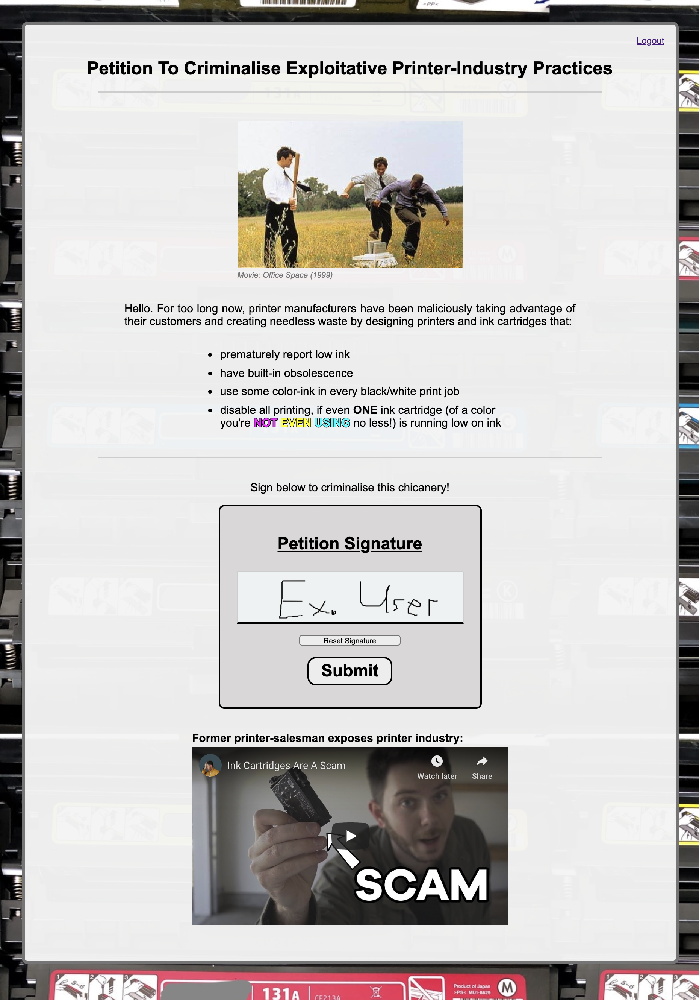
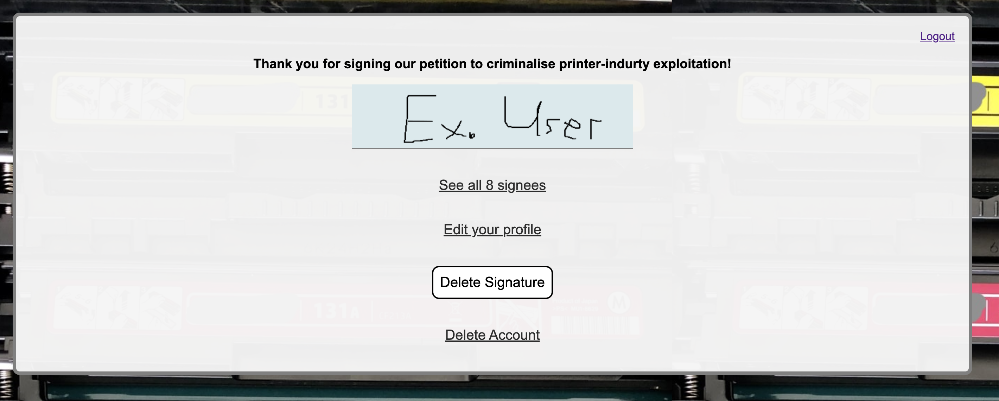
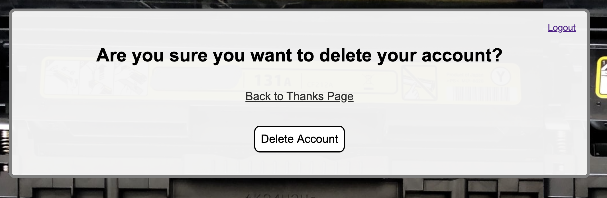
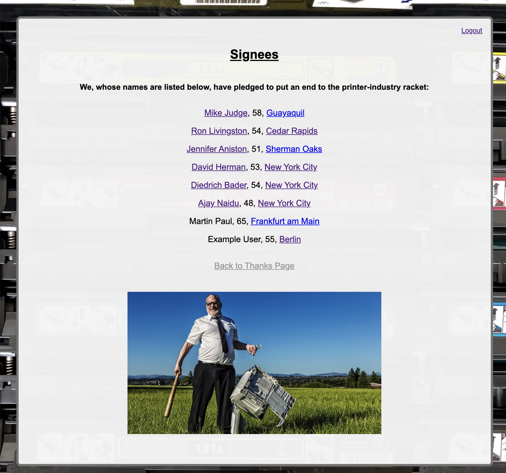
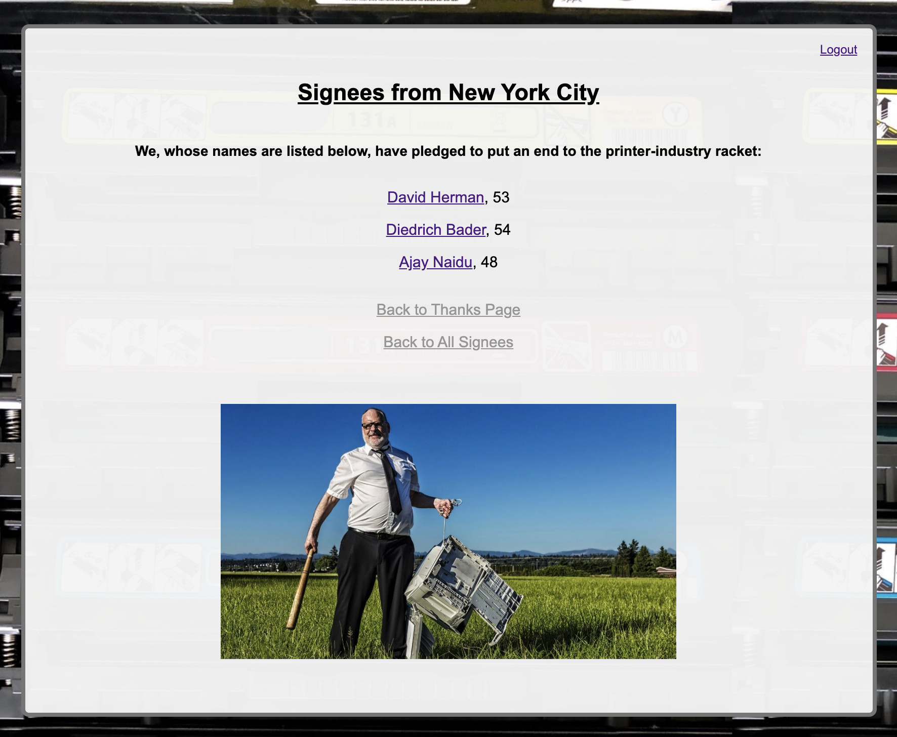
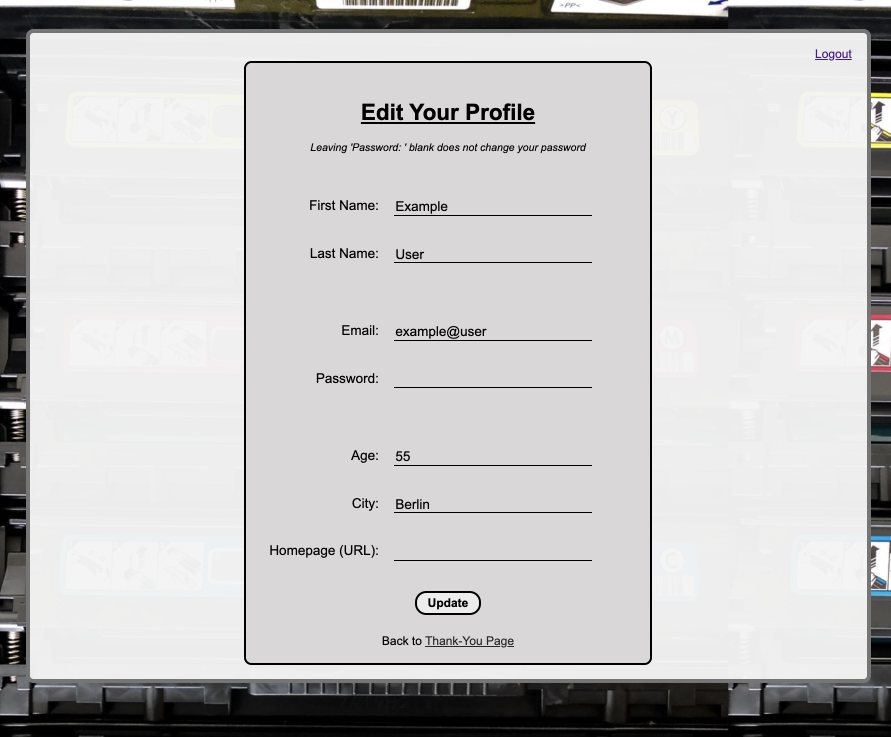
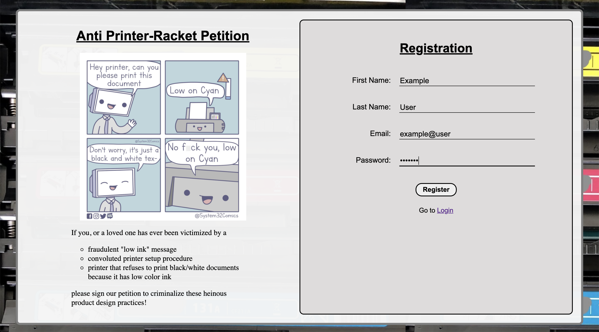
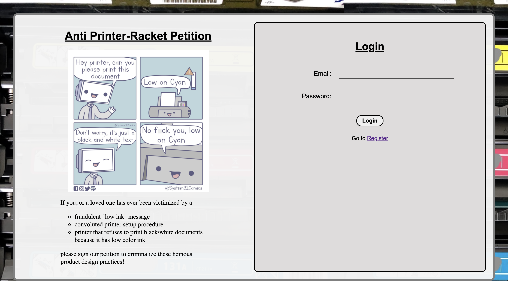
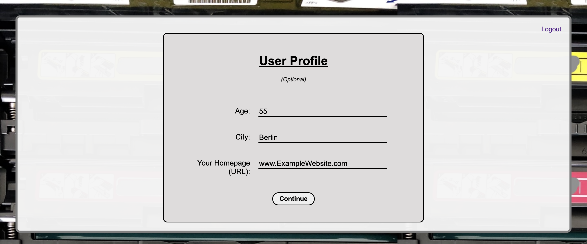

# Petition

A petition website where the user can create an account, provide personal information, sign the petition, and view other signees.

## Features

-   CSRF protection
-   Page access restrictions depending on which information has been provided by the user (e.g. Thanks page can only be accessed after user has submitted a signature)
-   Petition Page
    -   Canvas for digitally signing the petition
        -   Reset signature attempt
    -   Embedded informational video
    -   Error message when attempting to submit empty canvas
    -   Redirect to Thanks page upon signature submission
-   Thanks Page
    -   Shows your submitted signature
    -   Links to
        -   View-Other-Signees page
        -   Edit-Profile page
        -   Delete Signature (redirects back to Petition page)
        -   Delete Account
-   View-Other-Signees Page
    -   Shows list of all other signees (name, age, city)
    -   Clicking on a city dynamically creates new page with only signees from that city
    -   Clicking on a signee's name opens a new tab and loads the url provided by that user in their profile
    -   Link back to Thanks page
-   Edit-Profile Page
    -   Allows user to edit their profile information (first & last name, email, password, age, city, homepage(url))
    -   Form validation checks to male sure email, and name fields are filled out (error message if not)
    -   Link to Thanks page
-   Register/Login pages
    -   Form validation checks to make sure fields have been filled out correctly (error messages if not)
    -   Upon registration, redirect to Provide-Profile-Information page
-   Provide-Profile-Information Page
    -   Input fields for age, city, homepage(url) (all optional)
    -   Only accessible once, immediately after registration. Afterwards profile information can only be edited through the Edit-Profile page

## Tech Stack

-   JavaScript
    -   jQuery
    -   Node.js
    -   Express
-   PostgreSQL - for storing user info (first- last name, email, hashed password, city, age, url)
-   Handlebars
-   HTML
-   CSS

## Screenshots

### Petition Page

### Thanks Page

### View-Other-Signees Page

### Edit-Profile Page

### Register/Login pages

#### Provide-Profile-Information Page

